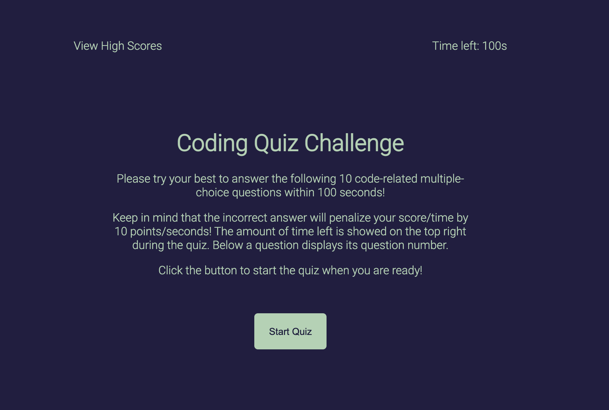
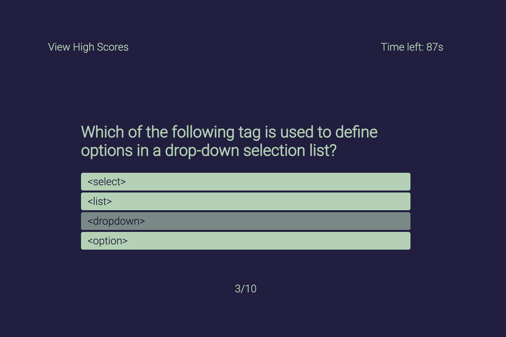
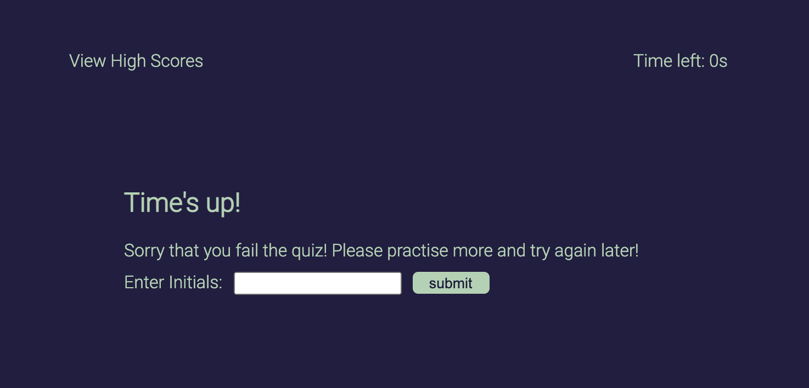
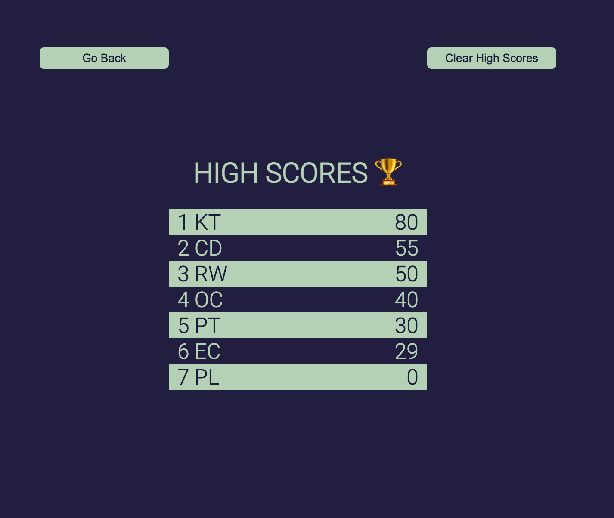
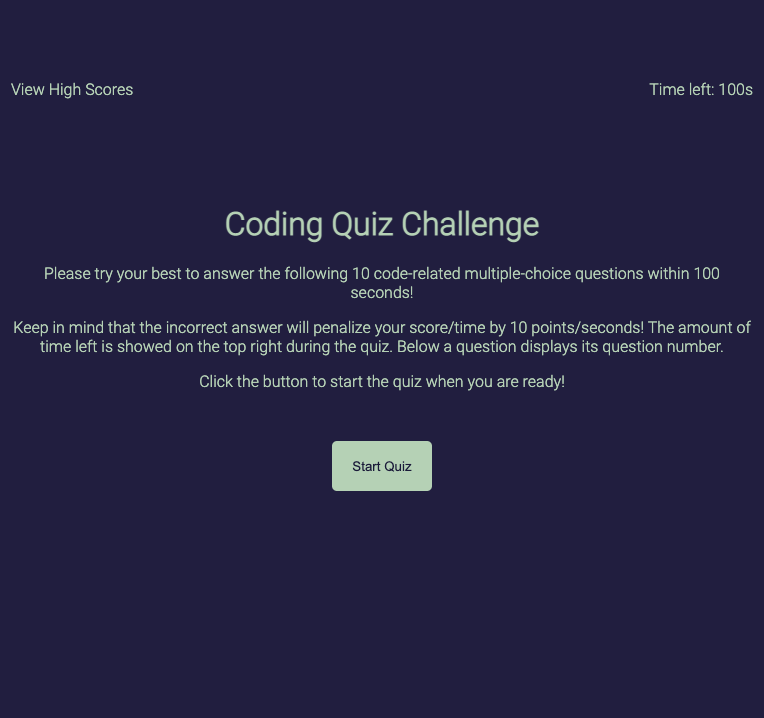
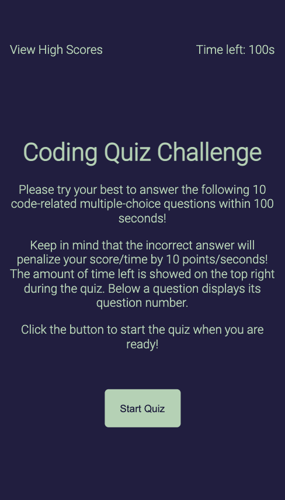

# code-quiz
This project provides a series of code-related mulpi-choice questions. Users who answers questions fast and correctly would get batter score and rank higher.

## Getting Started
```console
git clone https://github.com/qtian13/code-quiz.git
```

## Built With
* [HTML](https://developer.mozilla.org/en-US/docs/Web/HTML)
* [CSS](https://developer.mozilla.org/en-US/docs/Web/CSS)

## Features of the Code Quiz
1. The homepage displays the title and explains the rules of the quiz. Quiz starts when `Start Quiz` is clicked and quiz timer is triggered at the same time. On the top left is a link to high score page. User can click to check the current score record. On the top right shows the left time for the quiz

2. During the quiz:
    * a series of multi-option questions are rendered one by one. 
    * The option background color would change while the mouse hover over it which helps user choose the one they want
    * User can check the time left on the top right corner which is updated every second.
    * Users can also check the index of current question at the bottom of the page. 
    
    * When an option is clicked, the next question renders right away
    * The result of the previous question is displayed below the question card and disappear after 1.5 second or options of current questions is clicked which comes early.
    
3. The quiz result page is loaded when time is up or when all the questions are done. Users can enter their initials and click `submit` to record their score. The initials and score would be added to quiz results stored in `Local Storage`. The high score page would load after the form is submitted.

4. When the high score page is loaded, the user can view the quiz results history ordered by the score from high to low. There are also two buttons on this page. One to go back to the homepage and the other one is to clear the score history displayed and one stored in `Local Storage`

5. The page display is screen responsive
5. The data of questions are stored in JSON file
## Page URL
https://qtian13.github.io/code-quiz/
## Page Screen Shot with Different Screen Width



## Author
Qiushuang Tian
- [Link to Portfolio Site](https://qtian13.github.io/)
- [Link to Github](https://github.com/qtian13)
- [Link to LinkedIn](https://www.linkedin.com/in/qiushuang-tian-a9754248/)

## Acknowledgments
- [Berkeley Coding Boot Camp](https://bootcamp.berkeley.edu/coding/) provided start code

